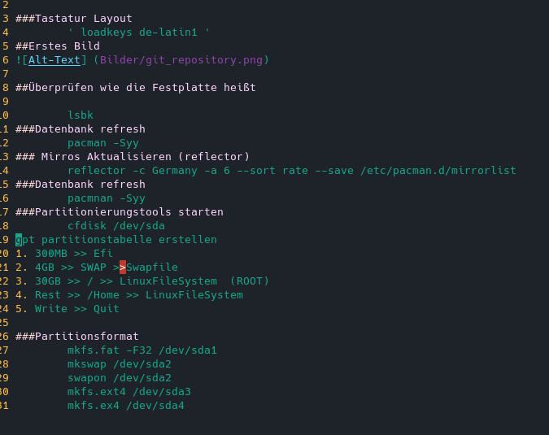

# Archlinux Installation (VirtualBox)

### Tastatur Layout
	' loadkeys de-latin1 '
## Erstes Bild

## Überprüfen wie die Festplatte heißt

	lsbk
### Datenbank refresh
	pacman -Syy
### Mirros Aktualisieren (reflector)
	reflector -c Germany -a 6 --sort rate --save /etc/pacman.d/mirrorlist
### Datenbank refresh
	pacmnan -Syy

### Partitionierungstools starten
	cfdisk /dev/sda
	gpt partitionstabelle erstellen
1. 	300MB >> Efi
2.	4GB >> SWAP >>Swapfile
3. 	30GB >> / >> LinuxFileSystem  (ROOT)
4. 	Rest >> /Home >> LinuxFileSystem
5. 	Write >> Quit

### Partitionsformat
	mkfs.fat -F32 /dev/sda1
	mkswap /dev/sda2
	swapon /dev/sda2
	mkfs.ext4 /dev/sda3
	mkfs.ex4 /dev/sda4
### DokumentationFoto

